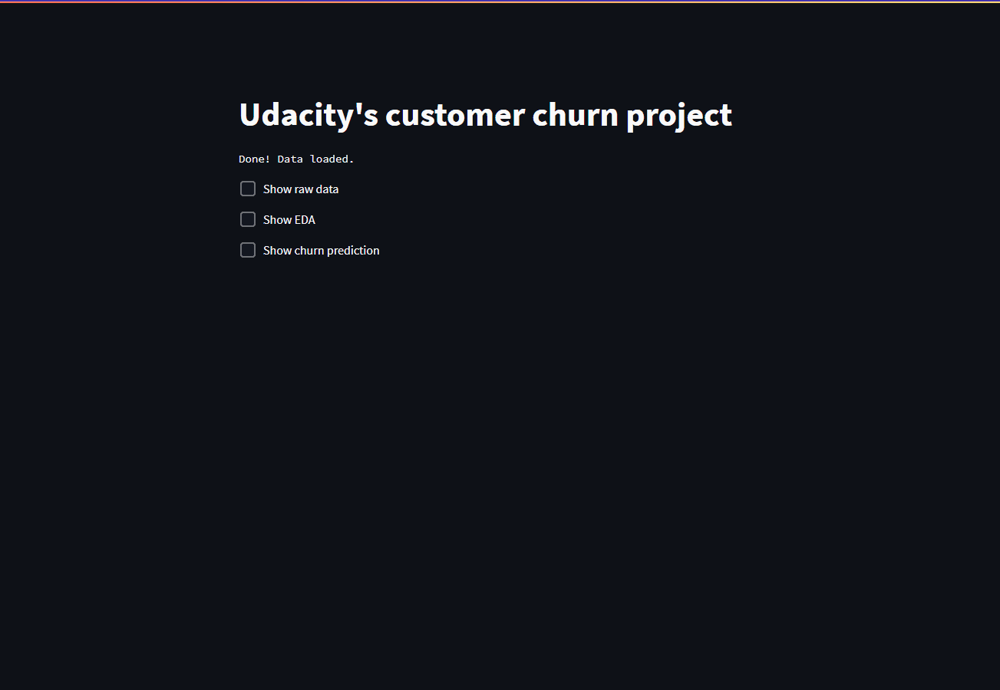

# Predict Customer Churn

- Project **Predict Customer Churn** of ML DevOps Engineer Nanodegree Udacity

## Project Description

This is the first project of the ML DevOps Engineer Nanodegree Udacity.

<table style="width:100%; th, td {
  border-style: none;
}">
  <tr>
    <td></td>
    <td><p style="word-wrap: break-word">The project was created using the Streamlit as the frontend. In this way is possible to visualize the output easier.</p></td>
  </tr>
</table>

## Installing the project

This project uses [***Pipenv***](https://pipenv.pypa.io/en/latest/). In your root folder, open a terminal and enter:

```bash
pip install pipenv
pipenv install
```

## Running Files

### Using the model

1. Download the data from [Kaggle's Credit Card customers](https://www.kaggle.com/sakshigoyal7/credit-card-customers), save it in *./data/external/* folder and rename it to **bank_data.csv**.

1. Open a terminal in the root folder and use the following command to initiate the web app in your local machine:

    ```bash
    streamlit run main.py
    ```

1. Open the *localhost:8501* in your browser.

**IMPORTANT!** Before running the line above, you need to install the project (see the section [Installing the project](#installing-the-project) ).

### Testing the model

1. Run the following command in terminal and within the virtual env:

    ```bash
    ipython churn_script_logging_and_tests_solution.py
    ```
